# tt_um_galaguna_NanoSys_fit: A foundry test for Nano119 CPU

## CPU features:
-	12-bit Instruction Pointer (256 ROM bytes, for code space, are implemented)
-	11-bit Data Pointer (32 RAM words, for data space, are implemented)
-	8-bit Stack Pointer (16 stack words are implemented)
-	Direct addressing operation
-	ALU with 16 bits operands and 32-bit result
-	119 instructions
-	Dedicated I/O busses to communicate with generic peripherals 
-	Interrupt capability
-	SPI interface to program the code space and access the data space
-	Configurable operating speed

## How it works

A simple architecture for practical implementation of a central processing unit (CPU) is proposed as teaching resource, to experiment and verify the fundamental concepts of a simple computer architecture with its instruction set (in this case, 119 instructions). In this project, a foundry test is implemented with minimal memory resources. A block diagram for the proposed architecture is presented in the following figure:  

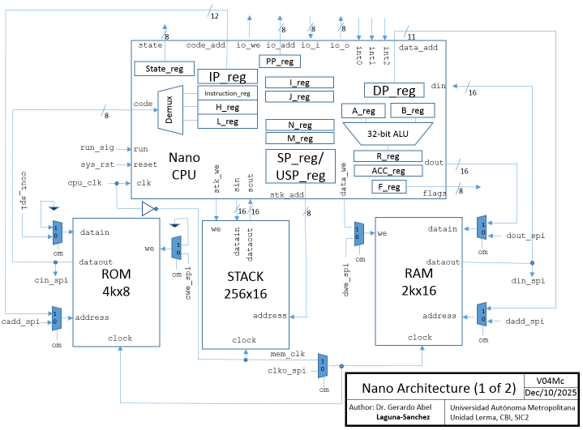

The auxiliary modules are presented in the following figure:  

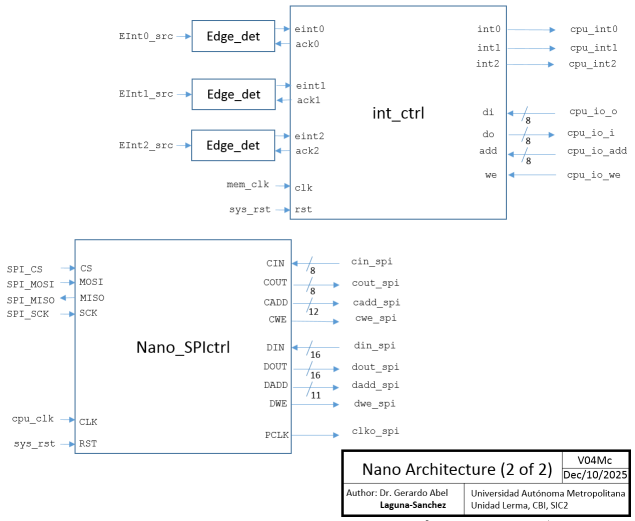

To enable user access to both code and data memory spaces, before and after the execution of any program, the processing system includes a slave SPI communication block. The multiplexors are controlled by MODE signal to set the operation mode (programming/execution). Additionally, RUN signal is dedicated to start the code execution. 

In practice, to work with the input and output ports of the Tiny Tapeout template, the entire system (with minimal memory) has been packaged in the Nano_sys_4Tiny module, which is represented schematically below:

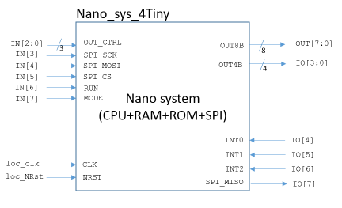

In the Nano_sys_4Tiny module, the input bus OUT_CTRL is used to select the internal signal buses that will be available at the output ports OUT8B and OUT4B, according to the following table:

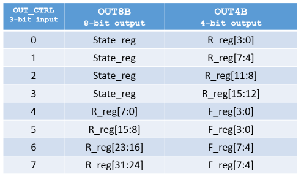

For mor details, see the HDL code Nano_mcsys_4Tiny_fit.v.

### Architectural overview
The proposed CPU uses a Harvard architecture in which program, data and IO are accessed from separate busses. The data word size is 16 bits while the code word size is 8 bits. The 16-bit ALU is a general-purpose arithmetic and logic unit and its result is always stored in the 32-bit R register. 
The arithmetic instructions affect the values of the following flags:
-	Z16: 16 bits Zero / Equal
-	N16: 16 bits negative / Less tan
-	O16: 16 bits overflow
-	CO16: 16 bits catastrophic overflow
-	Z32: 32 bits Zero
-	N32: 32 bits negative
-	O32: 32 bits overflow
-	CO32: 32 bits catastrophic overflow
Z16, N16, O16 and CO16 flags are set based on the 16 least significant bits of R register, while Z32, N32, O32 and CO32 flags are set based on the whole R register. The catastrophic overflow is set when the result sign does not correspond with the expected. The logic instructions only affect the Z16 and Z32 flags.

The architecture includes the following registers:
-	State register: To track the CPU micro-states
-	IP register: 12-bit Instruction Pointer, to access the code space     
-	DP register: 11-bit Data Pointer, to access the data space
-	SP register: 8-bit Stack Pointer, to access the stack space by means push and pop instructions
-	USP register: 8-bit User Stack Pointer, to access the stack space in a random way
-	PP register: 8-bit Peripheral Pointer, to access the I/O space
-	A and B registers: Generic 16-bit operand registers
-	R register: Generic 32-bit result register
-	Acc register: 32-bit result register for AC and MAC instructions
-	I and J registers: 16-bit counting registers for iteration loops
-	N and M registers: 16-bit target count registers for iteration loops
Additionally, the architecture includes the following internal registers that are not directly accessible by the user:
-	F register: 8-bit Flags register
-	Instruction, H and L registers: 8-bit registers, used at instruction decode process to store op code and parameters values
In this foundry implementation (with Tiny tapeout initiative), due to physical space restrictions, the available memory resources are the following:
-	256 ROM bytes
-	32 RAM words
-	16 stack words

 
### Program memory organization
The CPU has 12-bit instruction pointer capable of addressing a 4k x 8 program. The reset vector is at 0x0000, while the interrupt vectors are at 0xFF7, 0xFFA and 0xFFD, for Int2, Int1 and Int0, respectively.

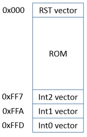

### Stack
The CPU can address a 256- level deep x 16-bit wide stack. The push instruction first stores the data and later increment de SP. The pop instruction first decrements de SP and later restore the data.
The user can access the stack space by means push/pop instructions or with data transfers by means the USP pointer. The instruction call automatically pushes the IP in the stack and the ret instruction pops it to continue the program Flow. 
In the case of an interruption, if it is detected while running a program, the system automatically pushes the IP, R and F registers, while reti instruction pops all these.

### I/O interface
The CPU provides dedicated buses to access generic peripherals by means In and out instructions. The user can add a required peripheral with this interface. In the current implementation, it has been reserved the first two locations of I/O space, i.e. 0x00 and 0x01, to control the 3 available interrupts.

### Interrupts
The CPU has 3 external sources of interrupt, denoted as Int0, Int1 and Int2. The highest priority is assigned to Int0, while the lowest priority is assigned to Int2. If it is enabled, an interruption can be served while a program is executed, but also if the CPU is at stop status. When the interrupt service is required while a program is executed, it implies the usual context saving process. On the other hand, when the interrupt service is required while a program is stopped, it does not save the context.  The registers to control these interrupts are mapped in the first two locations of the I/O space:
-	IE reg: Interrupt Enable register, mapped at 0x00 of I/O space
-	IF reg: Interrupt Flags register, mapped at 0x01 of I/O space

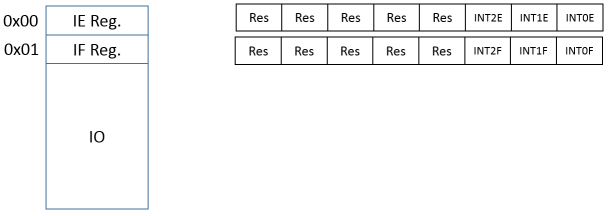

To enable an interruption, it is necessary to set the corresponding bit in IE register. When an interruption is enabled and it occurs (a positive edge is detected in the interrupt pin), the system automatically set the corresponding interruption flag in IF register and no other interrupt can be attended. Then, when the interrupt service routine finishes its task, before reti instruction, the interrupt flag must be cleaned.

### Instruction set
The proposed instruction set is can be conveniently codified with bytes. The following tables summarizes the proposed instruction codification:

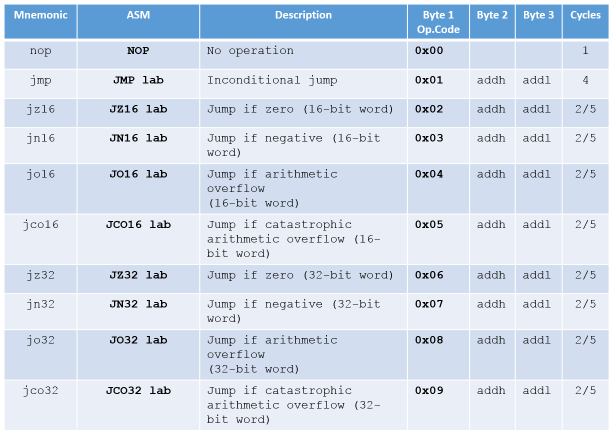
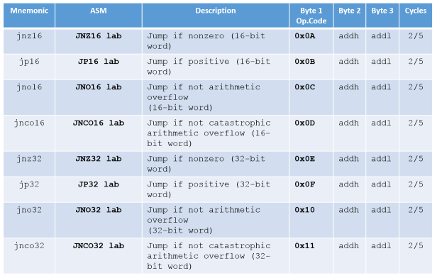
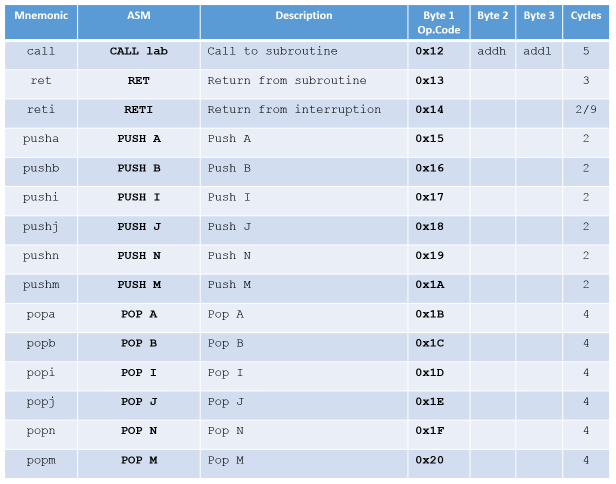
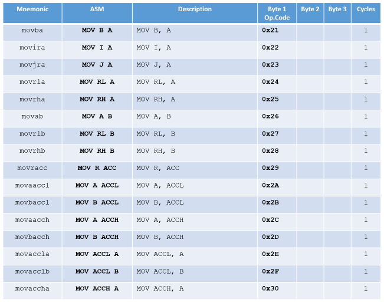
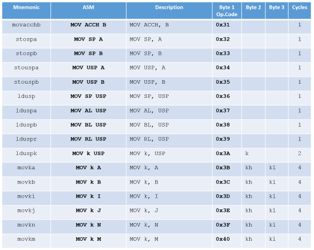
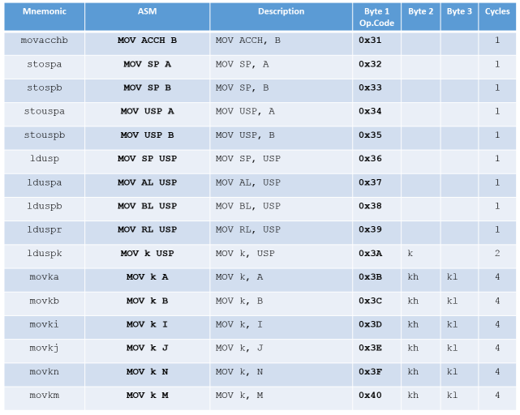
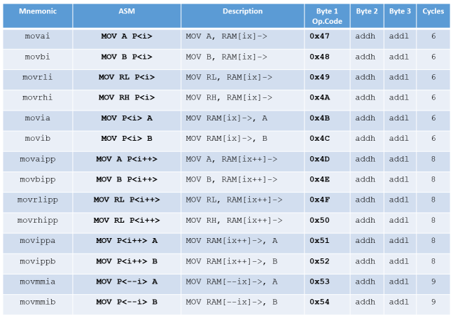
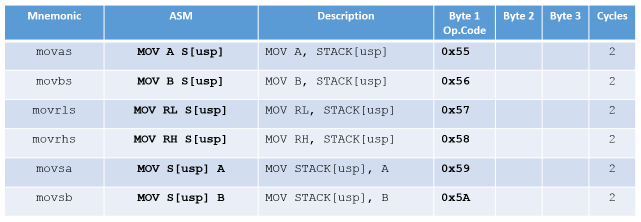
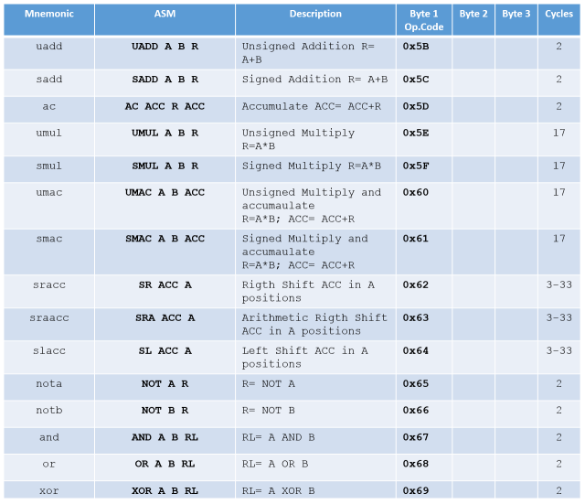

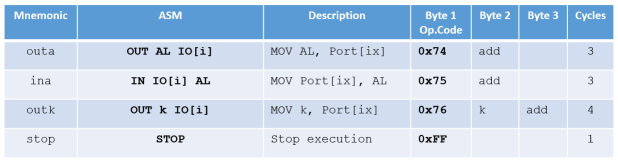

The following is a demo program:

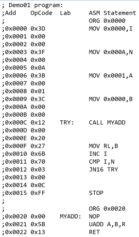

## How to test

The CPU system must be programed before a code execution. The RAM and ROM loads are enabled with signal MODE=0. With signal MODE=1, the code execution starts with signal RUN=1.  

To program the code space and access the data space, SPI transfers are used. The SPI word size is 32 bits with the following format:

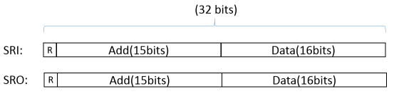

The bit 31 (MSB) is set to specify a read operation. The address field specifies the location being accessed and de data field contains the information to be written or read. In the following figure, the SPI addressing map is presented:

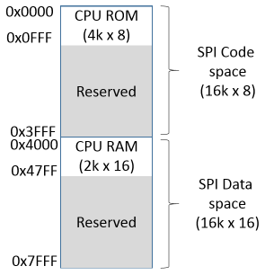
  

For SPI transfers, the following specification is assumed:
- CS signal is active low, and it idles high. 
- SCK signal is active low, and it idles high.
- Data is valid on the second SCK edge (rising or falling) after CS has been asserted. 
- The most significant bit is the first to be transmitted.

In the case of a read sequence, the read command must be followed by a stuff SPI word (let's say, all ones or all zeros word). The read information will be in the data field of the SPI word transmitted by the slave SPI.  

Within the slave_spi4nano module, the SCK frequency is assumed as CLK/8. For example, if the CLK frequency is 50 MHz, the SCK frequency is 6.25 MHz. SPI interface also works with low frequency, for example, if CLK frequency is 1525.879 Hz, the SCK frequency is 190.8 Hz. As a quick and practical reference for SPI signaling, although rough but illustrative, you can refer to the test code test.py.

## Additional hardware

As practical reference, a master SPI module, may be found in the following repository:

https://github.com/galaguna/Nano119-CPU-programmable-with-SPI

